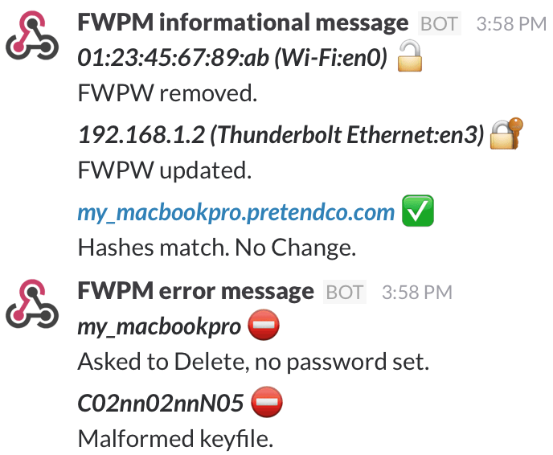
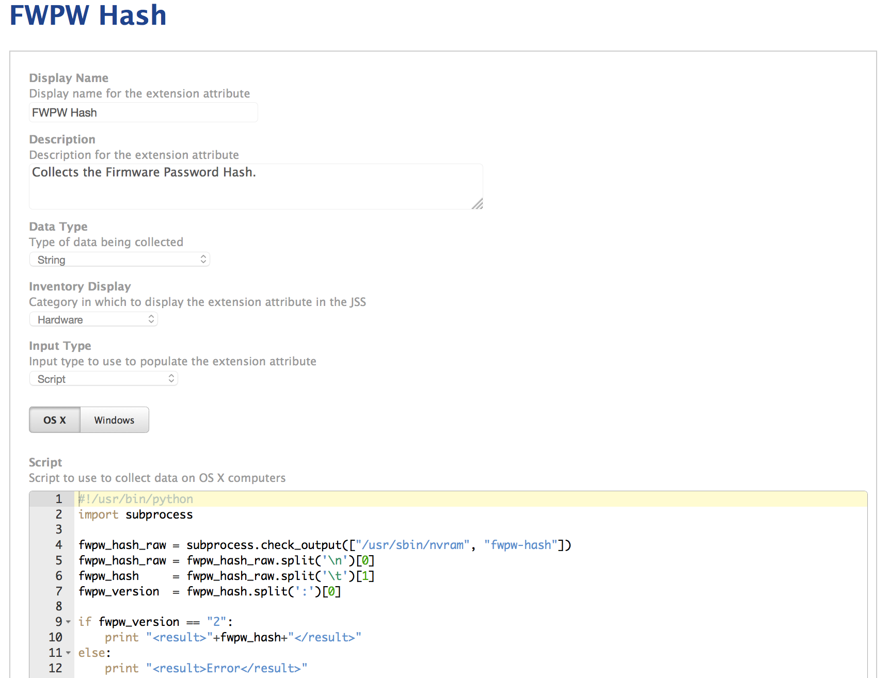
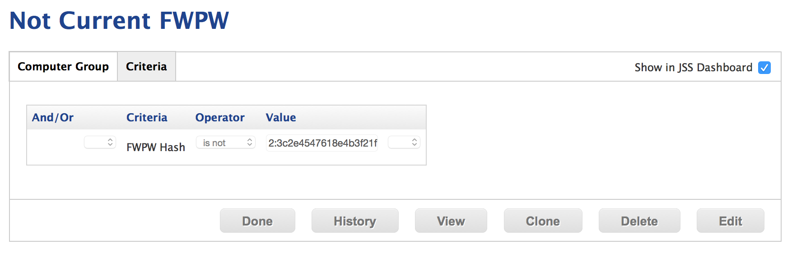

# Firmware Password Manager 2.1

A Python script to help Macintosh administrators manage the firmware passwords of their computers.

## Contents

* [Download](#download) - get the .dmg
* [Contact](#contact)
* [System Requirements](#system-requirements)
* [Install](#install)
* [Uninstall](#uninstall)
* [Purpose](#purpose)
* [Usage](#usage)
  * [Options](#options)
  * [The keyfile](#the-keyfile)
  * [Security](#security)
  * [Example](#example)
  * [Slack integration](#slack-integration)
  * [JAMF JSS extention attribute](#jamf-jss-extention-attribute)
  * [nvram](#nvram)
  * [firmwarepasswd](#firmwarepasswd)
  * [Error messages](#common-error-messages)
* [New features in version 2.1](#new)
* [Notes](#notes)
* [Update History](#update-history)

## Download

[Download the latest installer here!](../../releases/)

## Contact

If you have any comments, questions, or other input, either [file an issue](../../issues) or [send us an email](mailto:mlib-its-mac-github@lists.utah.edu). Thanks!

## System Requirements

* Python 2.7+ (which you can download [here](https://www.python.org/download/))
* Pexpect 3.3+ (which you can download [here](https://github.com/pexpect/pexpect))
* [Management Tools](https://github.com/univ-of-utah-marriott-library-apple/management_tools) - version 1.6.0 or greater

## Install

Place the script in a root-executable location. We use `/usr/local/sbin/`. Make sure it is executable.

## Uninstall

Remove the script.

## Purpose

Version 2.0 represents a complete rewrite of Firmware Password Manager (FWPM). The previous version, a shell script, always felt brittle to me. The new version is written in Python. I also focused on utilizing `firmwarepasswd`, rather than the outdated `setregproptool`.

When I began this project there wasn't a solution available for managing firmware passwords, other than the "set-it-and-forget-it" method. This approach seems error-prone and difficult to maintain beyond more than a small handful of machines. My solution centers on maintaining a single list of current and formerly used passwords that I call the keyfile. This approach allows the administrator to easily bring any number of machines up to the current password, and identify those whose firmware passwords aren't in the master list and need additional maintenance.

`firmware_password_manager.py` will use your keyfile to set a firmware password on a machine with no existing firmware password, attempt to change the existing firmware password to your new password or remove the current password. The script is best used when it can be installed and left on the machine for future use. This allows the admin to then create an installer package containing the keyfile and a postflight action to run FWPM. Or the admin could create a launchagent to run FWPM at every boot


## Usage

```
firmware_password_manager.py [-hv] [-#rmn] [-k keyfile] [-t] [-s]
```


### Options

 Flag | Purpose
--------|---------
`-h`, `--help` | Prints help information and quits.
`-v`, `--version` | Prints version information and quits.
`-r`, `--remove` | Remove the current firmware password.
`-m`, `--management` | Define managment string in nvram.
`-#`, `--hash` | Record hash of keyfile in nvram entry. FWPW 1.0 behavior. Default choice.
`-n`, `--nostring` | Do not set management string.
`-k`, `--keyfile` | Provide the path to the keyfile.
`-t`, `--testmode` | More verbose logging, will not delete keyfile.
`-s`, `--slack` | Sends important messages to Slack.
`-o`, `--obfuscate` | Accepts a plist containing the obfuscated keyfile.
`-b`, `--reboot` | Reboots the computer after the script completes successfully.

Certain flags are mutually exclusive. The script will refuse to run if more than one of the following flags are used: `-remove` `-management` `-hash` `-nostring`

### The keyfile

The script works with a text document I call the keyfile. It contains the new password, as well as any previously used passwords. Having previously used passwords available allows the script to update machines that may have been missed during previous runs of the script.

The script requires a specific format for the keyfile. Each lines contains the following: a note string, a colon, and a password string. No additional colons. I assume the newest passwords will be at the end of the file, and the script will try those first. Only the `new` note has a special meaning, others are ignored.

Here is the keyfile format:

Notes | Purpose
--------|---------
new|the new password to be installed.
note|any other note strings are ignored.
#new|a hash mark will cause the note to be ignored.


Here's an example keyfile:
```
previous:mGoBlue
other:brownCow
#new:short3rPasswd
new:goUtes
```
Version 1 made use of the `current` note to designate what was thought to be current password. Version 2 discovers the current password on its own and will ignore this note.

### Security

The keyfile contains, of course, incredibly sensitive information. When the script successfully completes or encounters an error, it attempts to securely delete the keyfile from the disk.

### Example

```
firmware_password_manager.py -s -k path/to/keyfile -#
```
This command will place a hash in nvram, slack informational messages and use the keyfile at `path/to/keyfile`.

### Slack integration

We make heavy use of Slack in our office. The `--slack` flag directs FWPM to send informational messages to a slack team. I have integrated the slack functionality of our management_tools library into FWPM. You simply need to add the URL and channel information for your Slack group to the script.

Please see Slack's documentation for additional configuration options: https://api.slack.com/incoming-webhooks

This image shows example messages in Slack:



### JAMF JSS extention attribute

We can leverage the nvram string and smart groups in JAMF Casper to automate the distribution of an updated keyfile package and direct clients to change their firmware passwords. We do this by defining an extension attribute (EA) in the JSS. We've included the script we run in the repository for FWPM 2.0.

The EA script runs during recon and pushes the hash up to the JSS. We then define a smart group that contains any machine not sharing the same hash as the current keyfile. This makes it possible to apply a policy directing those machines to download the new keyfile package and run FWPM.

The following image shows the EA page in the JSS:



This image shows the two possible smart group built using the EA:


Here is how the smart groups are built:



### nvram string

To make the most of FWPM, we suggest using the `--hash` flag to store the hash of the keyfile used to create the current firmware password. This allows you to use a variety of tools to remotely check the status of the firmware password on a machine. Using this flag the script will create an SHA-2 hash of the new keyfile and store it in non-volitile RAM (nvram) when the password is changed. The hash can then be accessed locally through the terminal or remotely with SSH, ARD or other tool.

The `--managment` allows you to define any string to place in nvram. You could record the date the password was changed last or a cryptic hint to help you remember the password in the future (not recommended).

### firmwarepasswd

Version 2 of FWPM uses Apple's `firmwarepasswd` tool to make changes to the firmware password. `firmwarepasswd` was shipped beginning with Mac OS X 10.10 "Yosemite". If you need to manage firmware passwords on OS X prior to 10.10, consider using the previous version of Firmware Password Manager.

### Common error messages

message|description
-------|-----------
Keyfile does not exist.| The script was not able to find the keyfile define by the user, check the path again.
No Firmware password tool available.|The script was unable to find the firmwarepasswd tool. Check that it has not been moved.
Asked to delete, no password set.|The user selected the -r/--remove flag to remove the firmware password, but no firmware password is set.
Malformed keyfile key:value format required.|The keyfile is not properly formatted. Follow the instructions above.
Multiple new keys.|multiple passwords are defined as new in the keyfile, you will need to comment or rename the additional new keys.
No `new` key.|No password in the keyfile has the `new` note, you will need to properly identify the password you wish the use.
Asked to delete, current password not accepted.|For this error to appear something very odd and unexpected has happened, contact the author.
Bad response from firmwarepasswd.|This is a catchall error stating that firmwarepasswd encountered an error.
Current FW password not in keyfile.| This is an critical message that the keyfile does not contain the current password.
nvram reported error.|This is a catchall error stating that nvram encountered an error.
An error occured. Failed to modify firmware password.|This means one of the above errors likely occured. Keep reading the log to find the exact error.

## New Features in version 2.1

Version 2.1 adds an important new security feature. I've included a new tool: `obfuscate_keylist.py`.

```
obfuscate_keylist.py -s original_keylist.txt -d obfuscated_keylist.plist
```
Flag|Purpose
-------|-----------
-s, --source|path to source keyfile
-d, --desination|path to save obfuscated keyfile
-t, --testmode|verbose output
-v, --version|show program's version number and exit
-h, --help|show help message and exit

This tool takes your original keyfile and outputs a base64-encoded property list. It's important to note that obfuscation is not technically encryption. The flag for FWPM to use this form of plist is `-o, --obfuscate`

I've also added a reboot flag `-b, --reboot`. If this flag is selected and the script finishes successfully, it will force a reboot.

Also new to this release is a sample script (`remotely_set_firmpwarepassword_scp_keylist.py`) showing how to remotely execute FWPM and securely copy (`scp`) your keyfile over the network. A shell script version is included for use in Apple's Remote Desktop.


## Notes
If you have forgotten the firmware password for a machine your available options depend upon the age of the machine.

If the machine is a MacBook Air (Late 2010) and later, MacBook Pro (Early 2011) and later, iMac (Mid 2011) and later, and Mac mini (Mid 2011) you will need to contact Apple. Please see these pages for additional info:

https://jamfnation.jamfsoftware.com/discussion.html?id=5474
http://www.ernieflores.net/osx-page-5/recovering-a-lost-firmware-password/

If you have an earlier machine, it's much easier:

1. Shutdown the machine. Remove the battery, if possible.
2. Change the configuration of RAM by removing a module.
3. Restart the machine and zap the PRAM 3 times. (Hold down Option, Command, p and r after you press the power botton, and wait for three restarts)
4. Shut the machine down and remove the battery, if possible.
5. Reinstall the RAM module.
6. Restart and the firmware password should be removed.

Thank you to macmule for <http://macmule.com/2014/05/11/ea-check-efi-password-state/>, which helped me get things working in version 1.

## Update History

Date | Version | Notes
-------|-----------|-------
2016.03.xx | 2.1.0 | Obfuscation, reboot flag, bug fixes
2015.11.05 | 2.0.0 | Python rewrite, Docs rewritten
2015.02.25 | 1.0.1 | Added use of firmwarepasswd on 10.10
2014.08.20 | 1.0.0 | Initial version.
